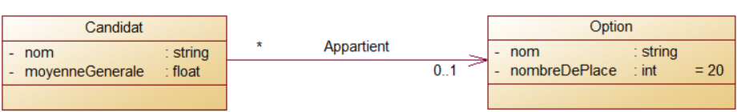

# Système de gestion du filiere étudiant

> Il s'agit d'un petit programme qui montre comment les étudiants sont sélectionnés dans divers domaines d'études en utilisant leur score d'examen.
> Ce programme résout le problème en utilisant l'algorithme du mariage stable.   
> Vous trouverez ci-dessous un exemple de capture d'écran extrait du programme. Les étudiants sont autorisés à choisir un maximum de trois domaines. Chaque domaine prend également au plus trois étudiants (Tous les paramètres peuvent être ajustés pour répondre aux besoins requis).
> 

### UML

##### Diagramme de classe

---



### Code d'implémentation des classes

---

- Candidat

```csharp
using System;
using System.Collections.Generic;

namespace Candidat_Filiere
{
    class Candidat
    {
        private string nom;
        private float moyenneGenerale;
        private List<Option> options = new List<Option>();
        private int limit;

        public Candidat(string nom, float moyenneGenerale, int limitOption = 3)
        {
            this.nom = nom;
            this.moyenneGenerale = moyenneGenerale;
            this.limit = limitOption;
        }

        public string Nom
        {
            set { nom = value; }
            get { return nom; }
        }

        public float MoyenneGenerale
        {
            get { return moyenneGenerale; }
        }

        public List<Option> Options
        {
            get { return options; }
        }

        public bool addOption(Option option)
        {
            if (options.Count >= limit) return false;

            options.Add(option);
            return true;
        }

        public Option getOption(int position)
        {
            if (position > limit) throw new Exception("Index out of bounds");

            return options[position];
        }
    }
}

```

- Option

```csharp
using System;
using System.Collections.Generic;

namespace Candidat_Filiere
{
    class Option
    {
        private string nom;
        private List<Candidat> candidats = new List<Candidat>();
        private int nombreDePlace;

        public Option(string nom, int nombreDePlace = 20)
        {
            this.nom = nom;
            this.nombreDePlace = nombreDePlace;
        }

        public string Nom
        {
            get { return nom; }
        }

        public bool ajouterCandidat(Candidat candidat)
        {
            if (candidats.Count >= nombreDePlace) return false;

            candidats.Add(candidat);
            return true;
        }

        public void printCandidats()
        {
            Console.WriteLine("Nom\tMoyen");
            Console.WriteLine("---------------------");
            candidats.ForEach(candidat =>
            {
                Console.WriteLine($"{candidat.Nom}\t{candidat.MoyenneGenerale}");
            });
        }
    }
}

```

### Code Pour l'agorithme

---

> Le code complet du programme se trouve dans le fichier [Program.cs](./Program.cs).  
> Vous trouverez ci-dessous le code de la fonction qui gère la logique de sélection.

```csharp
static void processRequests(List<Candidat> candidats)
        {
            candidats.ForEach(candidat =>
            {
                bool goToNext = false;
                int optionIndex = 0;

                while (!goToNext)
                {
                    try
                    {
                        var option = candidat.getOption(optionIndex);
                        var isSuccessfull = option.ajouterCandidat(candidat);
                        if (isSuccessfull)
                        {
                            goToNext = true;
                        }
                        else
                        {
                            optionIndex++;
                        }
                    }
                    catch (Exception)
                    {
                        goToNext = true;
                        break;

                    }
                }
            });
        }
```

### Creadits

---

Created by Owusu Kelvin Clark

### Tools used

---

- Microsoft Visual Studio
